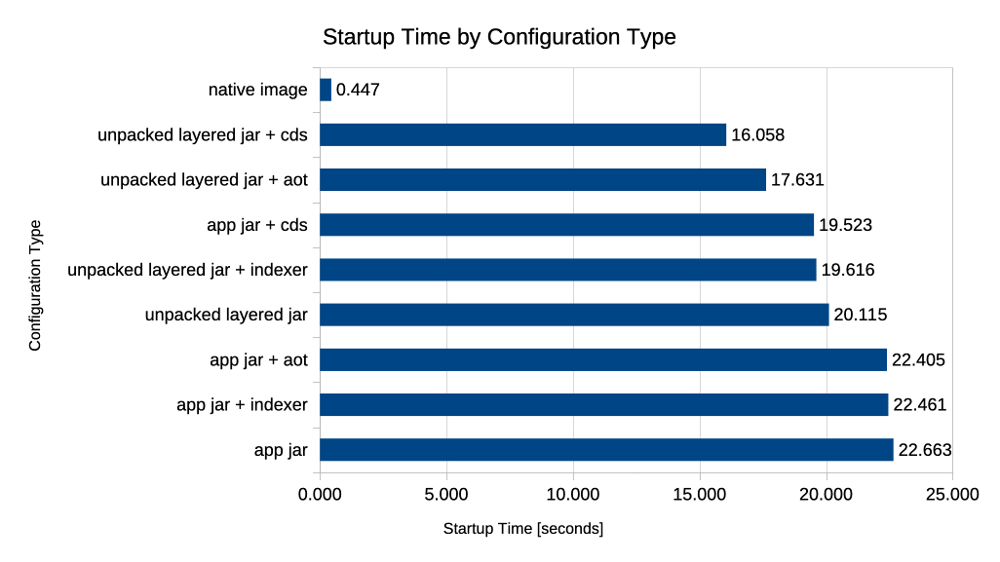

# Docker Spring Boot Startup Time Measurements

## Introduction

This repository is dedicated to measuring the startup times of a Spring Boot application under various configurations.
The goal is to compare different techniques and configurations that can be used to optimize the startup time of Spring
Boot applications, especially in the context of containerized environments like Kubernetes.

The measurements are performed using Docker, and the results will help in understanding how different configurations
affect the startup time of a Spring Boot application. The focus is on configurations such as using Spring Native, Spring
Indexer, Layertools, Class Data Sharing (CDS), Ahead-of-Time (AOT) compilation.

## Technologies Used

- Java 21, Java 24
- Spring Boot 3.5.x
- Spring Native
- Spring Indexer
- Layertools
- CDS
- AOT
- Docker
- Docker Compose
- Maven

## Measurements

### Methodology

Each different type of configuration is built using a separate Dockerfile. The application is started in each
configuration, and the startup time is measured.

To simulate a real-world scenario, the application contains REST API and is configured to connect to a PostgreSQL
database. Liquibase is used to manage the database schema.

Additionally, **resources are limited** to **0.5 vCPU** and **768MB of memory** to simulate limited resources under the
Kubernetes Cluster.

### Hardware and Limits

- CPU: Intel(R) Core(TM) i7-12700 12th Gen 12 Cores, 20 Threads, 25M Cache, up to 4.90 GHz
- OS: Linux, Ubuntu 24.04.3 LTS, Kernel 6.8.0-78-generic SMP x86_64
- Limits during measurements
  - CPU: 0.5 vCPU
  - Memory: 768MB RAM

### Measurements Results

#### Summary



#### Observations

TBD

#### Raw data

| Configuration                        | Measurement #1 [s] | Measurement #2 [s] | Measurement #3 [s] | Average [s] | % Relative to Base | Optimization vs Base |
|--------------------------------------|--------------------|--------------------|--------------------|-------------|--------------------|----------------------|
| app jar                              | 22.043             | 22.583             | 23.363             | 22.663      | 100.00%            | 0.00%                |
| app jar + indexer                    | 22.406             | 21.840             | 23.136             | 22.461      | 99.11%             | 0.89%                |
| app jar + cds                        | 18.055             | 20.519             | 19.994             | 19.523      | 86.14%             | 13.86%               |
| app jar + aot                        | 23.404             | 21.633             | 22.179             | 22.405      | 98.86%             | 1.14%                |
| unpacked layered jar                 | 19.646             | 20.370             | 20.329             | 20.115      | 88.76%             | 11.24%               |
| unpacked layered jar + indexer       | 19.204             | 20.085             | 19.560             | 19.616      | 86.56%             | 13.44%               |
| unpacked layered jar + cds           | 16.639             | 15.977             | 15.557             | 16.058      | 70.85%             | 29.15%               |
| unpacked layered jar + cds + indexer | 15.597             | 15.824             | 16.717             | 16.046      | 70.80%             | 29.20%               |
| unpacked layered jar + aot           | 17.376             | 18.204             | 17.314             | 17.631      | 77.80%             | 22.20%               |
| unpacked layered jar + aot + indexer | 15.542             | 17.513             | 16.678             | 16.578      | 73.15%             | 26.85%               |
| native image                         | 0.439              | 0.467              | 0.436              | 0.447       | 1.97%              | 98.03%               |

## How to Run

### Prerequisites

Some measurements require access to the application's database. You can use PostgreSQL running in a Docker container. To
start it, run the following command:

```bash
docker compose up
```

### Running Measurements

To run the measurements, execute each helper bash script. Each script will build the application for a specific
configuration and run it.

```bash
./Dockerfile-simple.sh
./Dockerfile-simple-indexer.sh
./Dockerfile-simple-cds.sh
./Dockerfile-simple-aot-cache.sh
./Dockerfile-layers.sh
./Dockerfile-layers-indexer.sh
./Dockerfile-layers-cds.sh
./Dockerfile-layers-cds-indexer.sh
./Dockerfile-layers-aot-cache.sh
./Dockerfile-native.sh
```

## Author

Dominik Cebula

- https://dominikcebula.com/
- https://blog.dominikcebula.com/
- https://www.udemy.com/user/dominik-cebula/
